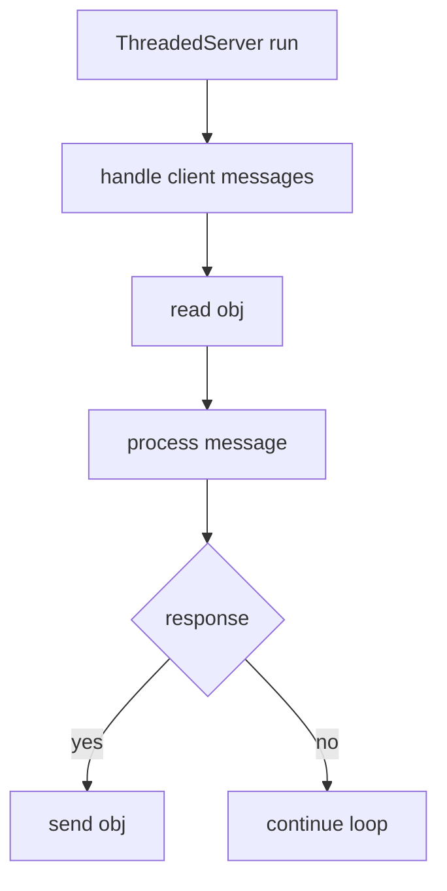
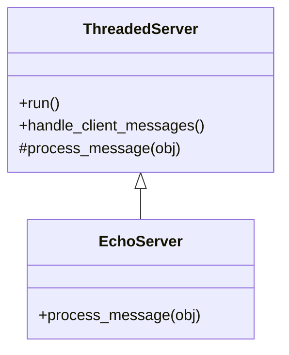
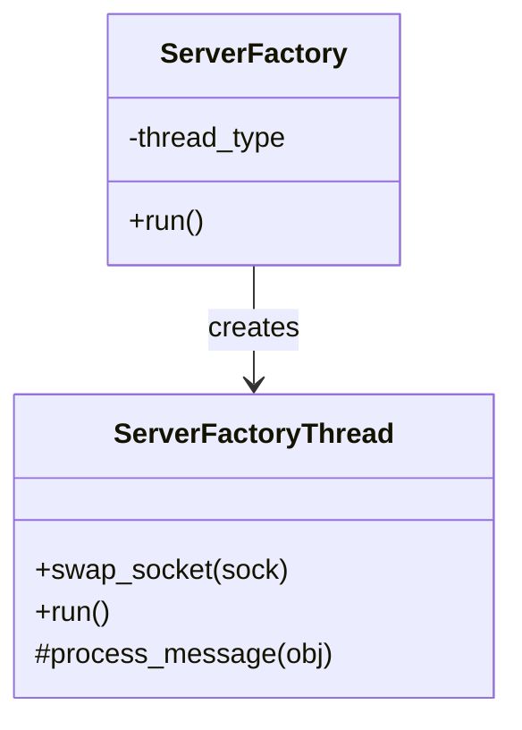
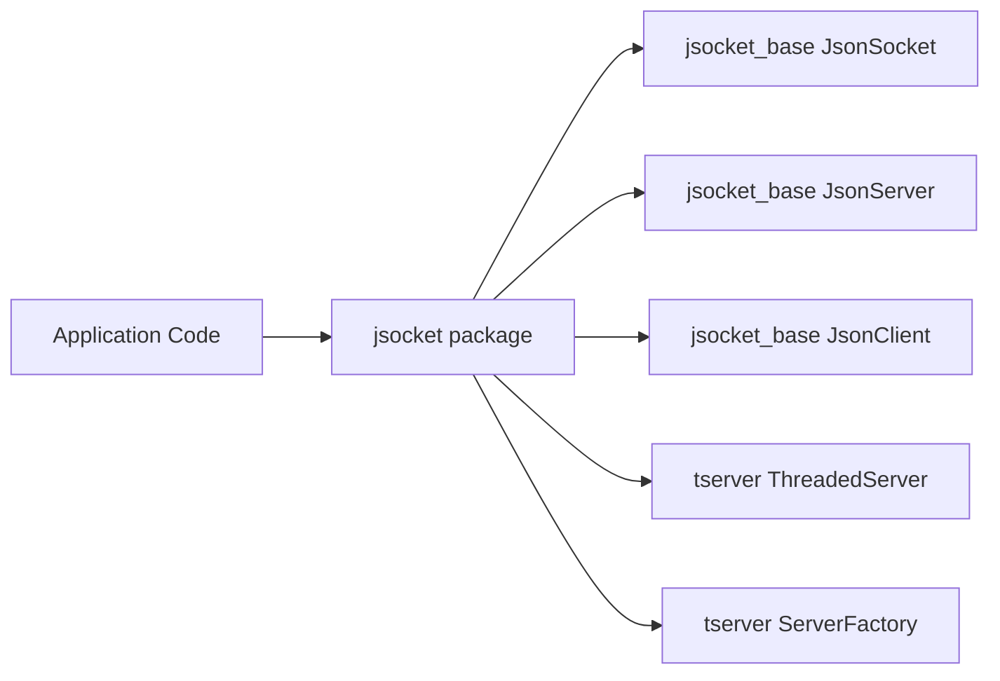

# Design Patterns in JSocket

This repo uses a few classic object-oriented design patterns. The diagrams below map directly to the current class structure and control flow.

## Template Method (Message Processing Loop)

`ThreadedServer` and `ServerFactoryThread` define the skeleton of a read-process-respond loop, and delegate the message-specific behavior to `_process_message`, which subclasses implement.

## Factory (Thread-per-Connection Workers)

`ServerFactory` accepts a `ServerFactoryThread` subclass and instantiates a new worker per connection. This is effectively a factory for connection handlers.

## Facade (Simplified Public API)

The top-level `jsocket` package re-exports the primary classes so callers can import from a single module instead of multiple internal modules.

